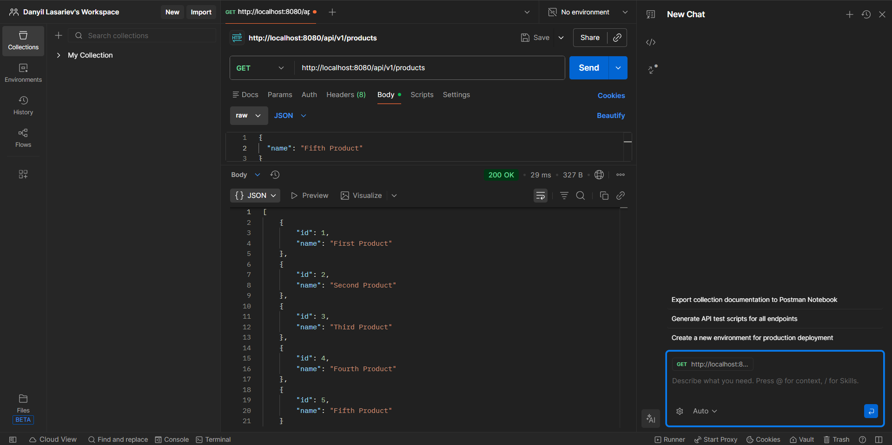
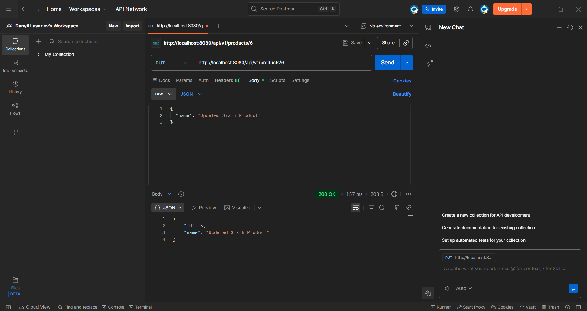
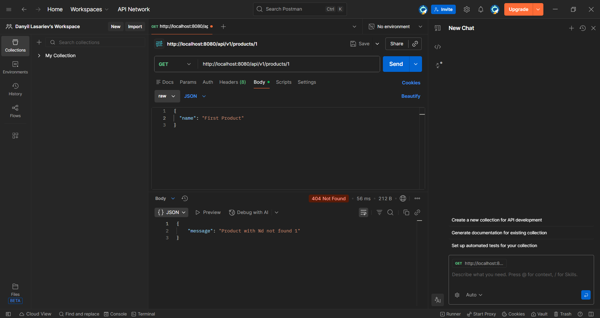

# Task 2 – Spring Boot REST API Application

## Description

This project is a REST API application created as Task 2.
It demonstrates building a backend application using Spring Boot with full CRUD functionality.
The application manages Product resources and uses an H2 in-memory database.
All endpoints were tested using Postman. Swagger is not used in this project.

---

# Technologies Used
- Java
- Spring Boot
- Spring Web
- Spring Data JPA
- H2 Database
- Maven
- IntelliJ IDEA
- Postman

---

# Project Structure

- product/api/ProductController.java
    – REST controller handling HTTP requests (POST, GET, PUT, DELETE)

- product/domain/Product.java
    – JPA entity representing Product

- product/service/ProductService.java
    – business logic layer

- product/repository/ProductRepository.java
    – database access layer (JPA repository)

- product/support/ProductMapper.java
    – maps request objects to entities and responses

- product/support/ProductExceptionSupplier.java
    – supplies custom exceptions

- product/support/exception/ProductNotFoundException.java
    – custom exception when product is not found

- shared/api/response/ErrorMessageResponse.java
    – error response object

- src/main/resources/application.properties
    – application configuration file

- README.md
    – project documentation

---

# Database Configuration (H2)

The application uses H2 in-memory database.

Configuration in application.properties:

spring.h2.console.enabled=true
spring.h2.console.path=/console
spring.datasource.url=jdbc:h2:mem:testdb
spring.jpa.show-sql=true

H2 Console available at:
http://localhost:8080/console

JDBC URL:
jdbc:h2:mem:testdb

---

# API Endpoints

Base URL:
http://localhost:8080/api/v1/products

---

# Create Product – POST

POST /api/v1/products

Request body example:
{
"name": "First Product"
}

Result:
Product is saved in database.
HTTP Status: 201 Created

---

# Get Product by ID – GET

GET /api/v1/products/1

Result example:
{
"id": 1,
"name": "First Product"
}

HTTP Status: 200 OK

---

# Get All Products – GET

GET /api/v1/products

Result example:

{
"id": 1,
"name": "First Product"
},
{
"id": 2,
"name": "Second Product"
}

HTTP Status: 200 OK

---

# Update Product – PUT

PUT /api/v1/products/1

Request body:
{
"name": "Updated First Product"
}

Result example:
{
"id": 1,
"name": "Updated First Product"
}

HTTP Status: 200 OK

---

# Delete Product – DELETE

DELETE /api/v1/products/1

Result:
Product removed from database.
No content returned.

HTTP Status: 204 No Content

---

# Get After Delete – GET

GET /api/v1/products/1

Result example:
{
"message": "Product with id 1 not found"
}

HTTP Status: 404 Not Found

---

# Testing

All endpoints were tested using Postman:
- POST – create product
- GET – get product by id
- PUT – update product
- DELETE – delete product
- GET after DELETE – verify deletion
H2 console was used to verify database content.

---

# Result

The application correctly performs all CRUD operations.
Products can be created, read, updated, and deleted.
After deletion, the product is no longer available in the database.